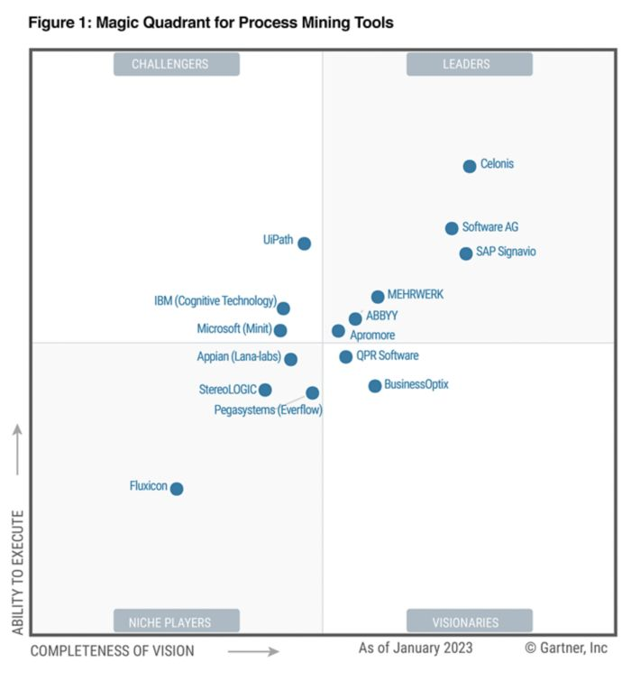

# Awesome Process Mining with Python 
A collection of awesome resources for process mining.  
Collecting Github and Non-GitHub resources

Inspired by [awesome-python](https://github.com/vinta/awesome-python).

## What is Process Mining (PM) ?  
* process of extracting valuable information from event logs/databases that are generated by processes.*
 * process discovery: analysing event data to see how a process actually looks like
 * conformance checking: comparing mined process to the reference model (=the process how it should be)
 * prediction: predicting e.g the state or point of time a future event has/occurs  

## Why Process Mining ?  
* identifying hidden nodes and bottlenecks in business processes.

---
---
# Gartner Magic Quadrant 2023 for Process Mining Tools 💡 

💡 

1. **Celonis**
   * company specialized on process mining founded 2011 in Munich, Germany <b>(market leader) </b>
   * [PAFnow](https://pafnow.com/) - company offers PM-software integrable into Power BI, founded 2014, acquired by Celonis 03/2022
2. **Software AG** (ARIS Process Mining)
3. **SAP Signavio**
   * start-up focused on Process Intelligence, acquired by SAP in 01/2021 
5. **MEHRWERK**
6. **UiPath Process Mining** 
    * UI Path acquired [ProcessGold](https://processgold.com) in 2020 - company offers process mining tool Eindhoven, Netherland
7. **ABBYY**
8. **Apromore**
9. **IBM**
10. **Microsoft Minit**
11. **Appian (Lana-Labs)**
    * former Lana Labs, data can be integrated into their PM-software via open API, founded 2016 in Berlin, Germany
13. **QPR Software(https://www.qpr.com/)**
    * software & consulting company for business processes & trategy founded 1991, Helsinki, Finnland
15. **BusinessOpix**
16.  **StereoLOGIC**
17.  **Pegasystems**
18. **Fluxicon** (Disco)

## Open-source-libraries
*libraries with free oder partially free editions*

* [ProM](http://promtools.org/doku.php) - framework that supports a wide variety of process mining techniques in the form of plug-ins
* [Apromore](https://apromore.org) - collaborative business process analytics platform, free community edition
* [BupaR](https://bupar.net/) - handling and analysis of business process data with R
* [PM4Py](https://pm4py.fit.fraunhofer.de/) - Python library that contains process mining alorithms for python
* [pmlab](https://github.com/pmlab/pmlab-full) -  interactive programming environment for (exploratory) process mining
* [RapidProM](https://github.com/rapidprom) - Process Mining as an extension for the data science framework RapidMiner

## Tools
*single implementations of certain process mining alorithms, that could help in certain fields of application*

* [pyalpha](https://github.com/zhoudaxia233/pyalpha) - Python tool that generates a Petri net using the Alpha Algorithm from event logs
* [csv2xes](https://github.com/rudeigerc/csv2xes) - python tool converting .csv file to .xes 

## JupyterNotebooks
*collection of nice process mining relevant jupyter notebooks*

* [alpha miner implementation.ipynb](https://github.com/mehdi149/Learning-projects/blob/master/Alpha%20miner%20implementation.ipynb) - implementation of alpha miner alorithm, input is csv, visualization of petri-net output with graphviz and sankes plugins
* [pmlab-exercises](https://github.com/pmlab/pmlab-exercises/tree/master/from-scratch) - code snippets for usage of PMLab library mentioned unter [Libraries](#libraries)
 
## FurtherResources
*collection of free information, books etc. about process mining*

* [Process Mining Book](https://fluxicon.com/book/read/#)
* [International Conference on Process Mining (ICPM)](https://icpmconference.org)
* [Video explaining how the very first PM-algorithm Alpha Miner works](https://www.futurelearn.com/courses/process-mining/0/steps/15636)
 
## FutureTrends
*possible future developments in the area of process mining*

#### You want to add some awesome links to this list?  - Nice!  
→ See [How-to-contribute](https://github.com/TheWoops/awesome-processmining/blob/master/CONTRIBUTING.md)

* interation of <b>Machine Learning Technologies</b>
    * to detect e.g. anomalies in process chains (e.g. fraud detection)
    * deviations to desired throughput time within certain process automatically trigger a recommended action
    
